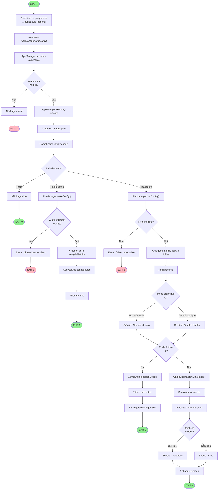

```mermaid
graph TD
    START([START]) --> A["Exécution du programme<br/>./JeuDeLaVie [options]"]
    A --> B["main crée AppManager(argc, argv)"]
    B --> C["AppManager parse les arguments"]
    C --> D{Arguments<br/>valides?}
    D -->|Non| E["Affichage erreur"]
    E --> END1([EXIT 1])
    D -->|Oui| F["AppManager.execute() exécuté"]
    F --> G["Création GameEngine"]
    G --> H["GameEngine.initialisation()"]
    H --> I{Mode demandé?}
    I -->|--help| J["Affichage aide"]
    J --> END2([EXIT 0])
    I -->|--makeconfig| K["FileManager.makeConfig()"]
    K --> L{Width et Height<br/>fournis?}
    L -->|Non| M["Erreur: dimensions requises"]
    M --> END3([EXIT 1])
    L -->|Oui| N["Création grille vierge/aléatoire"]
    N --> O["Sauvegarde configuration"]
    O --> P["Affichage info"]
    P --> END4([EXIT 0])
    I -->|--loadconfig| Q["FileManager.loadConfig()"]
    Q --> R{Fichier existe?}
    R -->|Non| S["Erreur: fichier introuvable"]
    S --> END5([EXIT 1])
    R -->|Oui| T["Chargement grille depuis fichier"]
    T --> U["Affichage info"]
    U --> V{Mode graphique<br/>-g?}
    V -->|Non - Console| W["Création Console display"]
    V -->|Oui - Graphique| X["Création Graphic display"]
    W --> Y{Mode édition<br/>-e?}
    X --> Y
    Y -->|Oui| Z["GameEngine.editionMode()"]
    Y -->|Non| AA["GameEngine.startSimulation()"]
    Z --> AB["Édition interactive"]
    AB --> AC["Sauvegarde configuration"]
    AC --> END6([EXIT 0])
    AA --> AD["Simulation démarrée"]
    AD --> AE["Affichage info simulation"]
    AE --> AF{Itérations<br/>limitées?}
    AF -->|Oui -ic N| AG["Boucle N itérations"]
    AF -->|Non -ic 0| AH["Boucle infinie"]
    AG --> AI["À chaque itération"]
    AH --> AI
    AI --> END7([EXIT 0])

    style START fill:#90EE90
    style END1 fill:#FFB6C1
    style END2 fill:#90EE90
    style END3 fill:#FFB6C1
    style END4 fill:#90EE90
    style END5 fill:#FFB6C1
    style END6 fill:#90EE90
    style END7 fill:#90EE90
```

---
