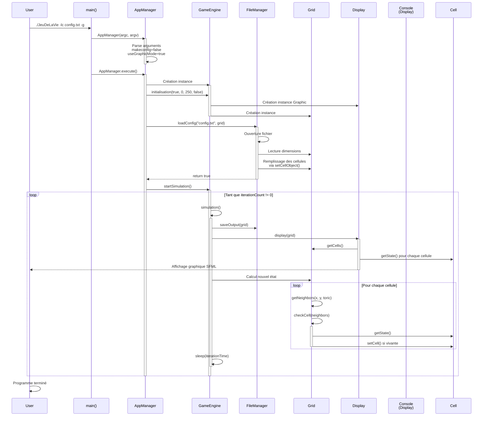

## Lancement avec configuration existante

```mermaid
sequenceDiagram
    participant User
    participant main as main()
    participant AppManager
    participant GameEngine
    participant FileManager
    participant Grid
    participant Display
    participant Console as Console<br/>(Display)
    participant Cell

    User->>main: ./JeuDeLaVie -lc config.txt -g
    main->>AppManager: AppManager(argc, argv)
    activate AppManager
    AppManager->>AppManager: Parse arguments<br/>makeconfig=false<br/>useGraphicMode=true
    deactivate AppManager

    main->>AppManager: AppManager.execute()
    activate AppManager
    AppManager->>GameEngine: Création instance
    activate GameEngine
    AppManager->>GameEngine: initialisation(true, 0, 250, false)
    GameEngine->>Display: Création instance Graphic
    GameEngine->>Grid: Création instance
    deactivate GameEngine
    
    AppManager->>FileManager: loadConfig("config.txt", grid)
    activate FileManager
    FileManager->>FileManager: Ouverture fichier
    FileManager->>Grid: Lecture dimensions
    FileManager->>Grid: Remplissage des cellules<br/>via setCellObject()
    FileManager-->>AppManager: return true
    deactivate FileManager
    
    AppManager->>GameEngine: startSimulation()
    activate GameEngine
    
    loop Tant que iterationCount != 0
        GameEngine->>GameEngine: simulation()
        activate GameEngine
        
        GameEngine->>FileManager: saveOutput(grid)
        GameEngine->>Display: display(grid)
        activate Display
        Display->>Grid: getCells()
        Display->>Cell: getState() pour chaque cellule
        Display-->>User: Affichage graphique SFML
        deactivate Display
        
        GameEngine->>Grid: Calcul nouvel état
        loop Pour chaque cellule
            Grid->>Grid: getNeighbors(x, y, toric)
            Grid->>Grid: checkCell(neighbors)
            activate Grid
            Grid->>Cell: getState()
            Grid->>Cell: setCell() si vivante
            deactivate Grid
        end
        
        GameEngine->>GameEngine: sleep(iterationTime)
        deactivate GameEngine
    end
    
    deactivate GameEngine
    deactivate AppManager
    User->>User: Programme terminé
```
