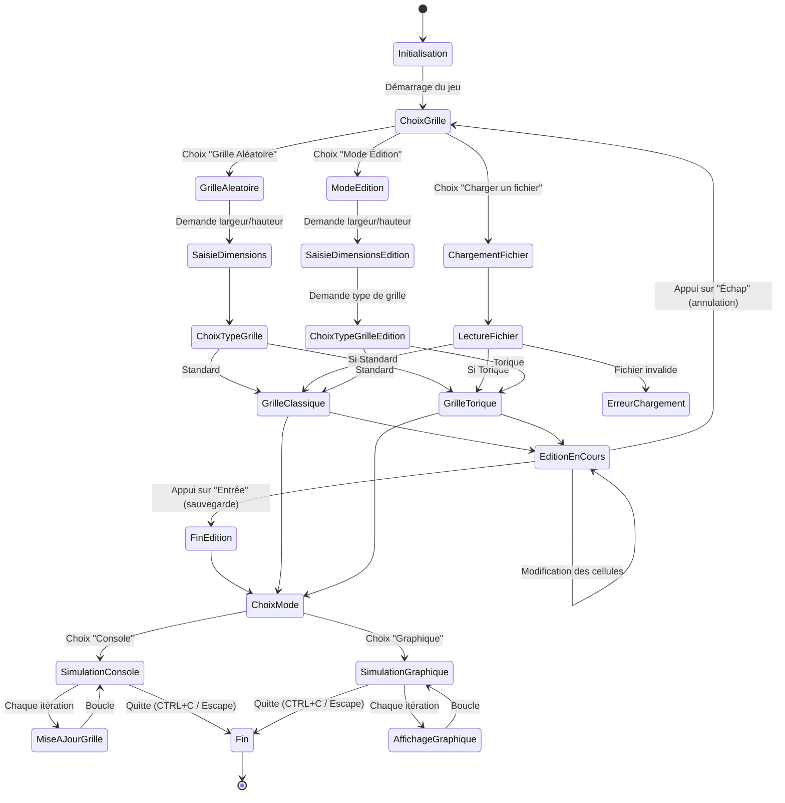

```mermaid
stateDiagram-v2
    [*] --> Initialisation

    Initialisation --> ChoixGrille : Démarrage du jeu

    ChoixGrille --> GrilleAleatoire : Choix "Grille Aléatoire"
    ChoixGrille --> ChargementFichier : Choix "Charger un fichier"
    ChoixGrille --> ModeEdition : Choix "Mode Édition"

    GrilleAleatoire --> SaisieDimensions : Demande largeur/hauteur
    SaisieDimensions --> ChoixTypeGrille
    ChoixTypeGrille --> GrilleClassique : Standard
    ChoixTypeGrille --> GrilleTorique : Torique

    ChargementFichier --> LectureFichier
    LectureFichier --> GrilleClassique : Si Standard
    LectureFichier --> GrilleTorique : Si Torique
    LectureFichier --> ErreurChargement : Fichier invalide

    ModeEdition --> SaisieDimensionsEdition : Demande largeur/hauteur
    SaisieDimensionsEdition --> ChoixTypeGrilleEdition : Demande type de grille
    ChoixTypeGrilleEdition --> GrilleClassique : Standard
    ChoixTypeGrilleEdition --> GrilleTorique : Torique
    GrilleClassique --> EditionEnCours
    GrilleTorique --> EditionEnCours

    
        EditionEnCours --> EditionEnCours : Modification des cellules
        EditionEnCours --> FinEdition : Appui sur "Entrée" (sauvegarde)
        EditionEnCours --> ChoixGrille : Appui sur "Échap" (annulation)
    

    FinEdition --> ChoixMode

    GrilleClassique --> ChoixMode
    GrilleTorique --> ChoixMode

    ChoixMode --> SimulationConsole : Choix "Console"
    ChoixMode --> SimulationGraphique : Choix "Graphique"

    SimulationConsole --> MiseAJourGrille : Chaque itération
    MiseAJourGrille --> SimulationConsole : Boucle
    SimulationConsole --> Fin : Quitte (CTRL+C / Escape)

    SimulationGraphique --> AffichageGraphique : Chaque itération
    AffichageGraphique --> SimulationGraphique : Boucle
    SimulationGraphique --> Fin : Quitte (CTRL+C / Escape)

    Fin --> [*]
```
    
