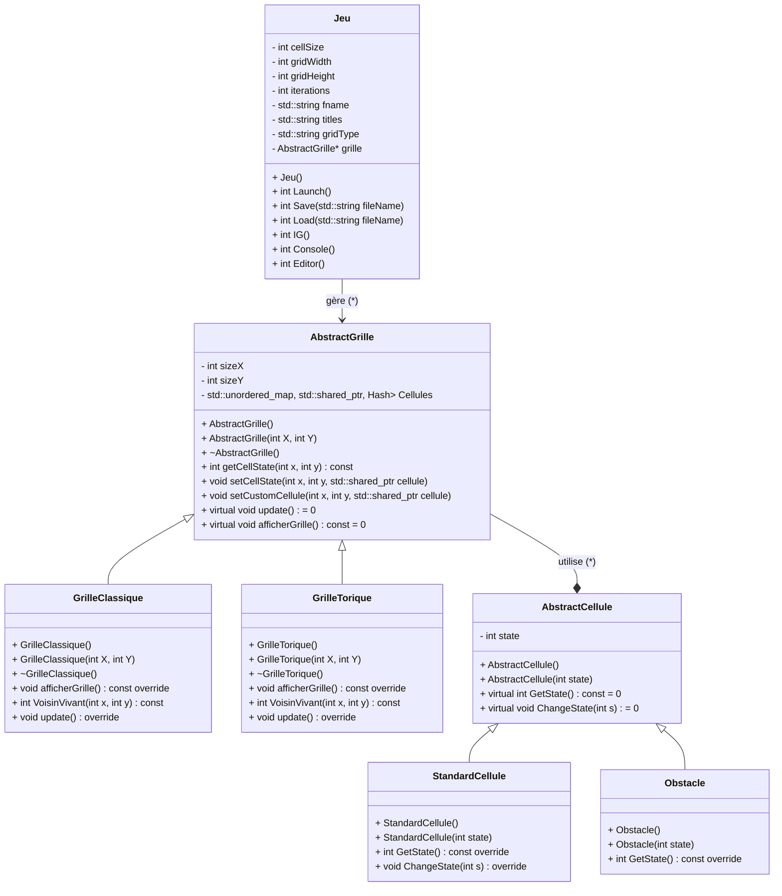

```mermaid
---
Titre : Dagramme de classe, Jeu de la vie
---
classDiagram
    class Jeu {
        - int cellSize
        - int gridWidth
        - int gridHeight
        - int iterations
        - std::string fname
        - std::string titles
        - std::string gridType
        - AbstractGrille* grille
        + Jeu()
        + int Launch()
        + int Save(std::string fileName)
        + int Load(std::string fileName)
        + int IG()
        + int Console()
        + int Editor()
    }

    class AbstractGrille {
        - int sizeX
        - int sizeY
        - std::unordered_map<std::pair<int, int>, std::shared_ptr<AbstractCellule>, Hash> Cellules
        + AbstractGrille()
        + AbstractGrille(int X, int Y)
        + ~AbstractGrille()
        + int getCellState(int x, int y) const
        + void setCellState(int x, int y, std::shared_ptr<AbstractCellule> cellule)
        + void setCustomCellule(int x, int y, std::shared_ptr<AbstractCellule> cellule)
        + virtual void update() = 0
        + virtual void afficherGrille() const = 0
    }

    class GrilleClassique {
        + GrilleClassique()
        + GrilleClassique(int X, int Y)
        + ~GrilleClassique()
        + void afficherGrille() const override
        + int VoisinVivant(int x, int y) const
        + void update() override
    }

    class GrilleTorique {
        + GrilleTorique()
        + GrilleTorique(int X, int Y)
        + ~GrilleTorique()
        + void afficherGrille() const override
        + int VoisinVivant(int x, int y) const
        + void update() override
    }

    class AbstractCellule {
        - int state
        + AbstractCellule()
        + AbstractCellule(int state)
        + virtual int GetState() const = 0
        + virtual void ChangeState(int s) = 0
    }

    class StandardCellule {
        + StandardCellule()
        + StandardCellule(int state)
        + int GetState() const override
        + void ChangeState(int s) override
    }

    class Obstacle {
        + Obstacle()
        + Obstacle(int state)
        + int GetState() const override
    }

    AbstractGrille <|-- GrilleClassique
    AbstractGrille <|-- GrilleTorique
    AbstractGrille --* AbstractCellule : utilise (*)
    AbstractCellule <|-- StandardCellule
    AbstractCellule <|-- Obstacle
    Jeu --> AbstractGrille : gère (*)

```
