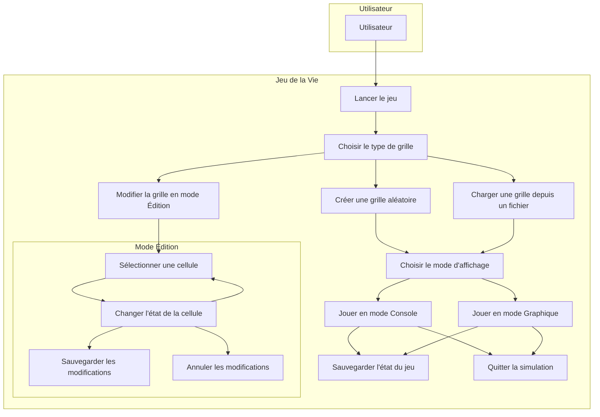

```mermaid
graph TD
  subgraph "Utilisateur"
    User["Utilisateur"]
  end

  subgraph "Jeu de la Vie"
    UC1["Lancer le jeu"]
    UC2["Choisir le type de grille"]
    UC3["Créer une grille aléatoire"]
    UC4["Charger une grille depuis un fichier"]
    UC5["Modifier la grille en mode Édition"]
    UC6["Choisir le mode d'affichage"]
    UC7["Jouer en mode Console"]
    UC8["Jouer en mode Graphique"]
    UC9["Sauvegarder l'état du jeu"]
    UC10["Quitter la simulation"]
    
    subgraph "Mode Édition"
      UC5a["Sélectionner une cellule"]
      UC5b["Changer l'état de la cellule"]
      UC5c["Sauvegarder les modifications"]
      UC5d["Annuler les modifications"]
    end
  end

  %% Relations entre l'utilisateur et les cas d'utilisation
  User --> UC1
  UC1 --> UC2
  UC2 --> UC3
  UC2 --> UC4
  UC2 --> UC5
  UC3 --> UC6
  UC4 --> UC6
  UC5 --> UC5a
  UC5a --> UC5b
  UC5b --> UC5a 
  UC5b --> UC5d

  UC5b --> UC5c
 
  
  UC6 --> UC7
  UC6 --> UC8
  UC7 --> UC9
  UC8 --> UC9
  UC7 --> UC10
  UC8 --> UC10

```
