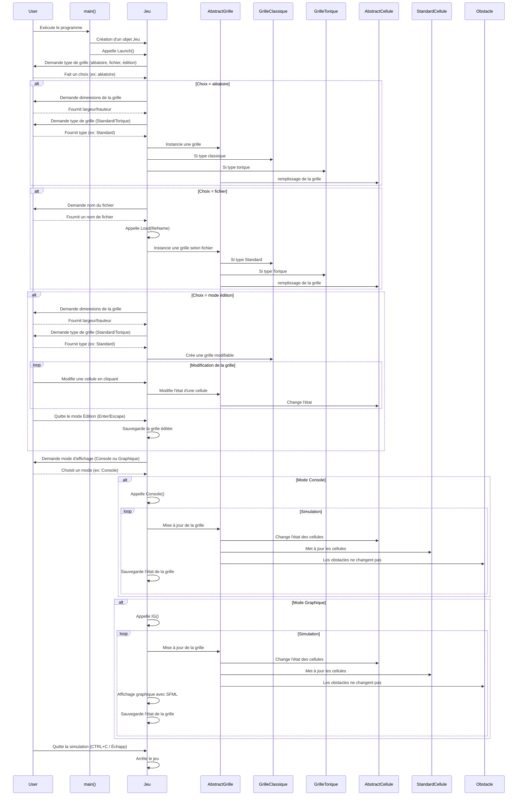

```mermaid

sequenceDiagram
    participant User
    participant main as main()
    participant Jeu
    participant AbstractGrille
    participant GrilleClassique
    participant GrilleTorique
    participant AbstractCellule
    participant StandardCellule
    participant Obstacle

    User->>main: Exécute le programme
    main->>Jeu: Création d'un objet Jeu
    main->>Jeu: Appelle Launch()
    
    Jeu->>User: Demande type de grille (aléatoire, fichier, édition)
    User-->>Jeu: Fait un choix (ex: aléatoire)

    alt Choix = aléatoire
        Jeu->>User: Demande dimensions de la grille
        User-->>Jeu: Fournit largeur/hauteur
        Jeu->>User: Demande type de grille (Standard/Torique)
        User-->>Jeu: Fournit type (ex: Standard)
        Jeu->>AbstractGrille: Instancie une grille
        Jeu->>GrilleClassique: Si type classique
        Jeu->>GrilleTorique: Si type torique
        AbstractGrille ->> AbstractCellule : remplissage de la grille
    end


    alt Choix = fichier
        Jeu->>User: Demande nom du fichier
        User-->>Jeu: Fournit un nom de fichier
        Jeu->>Jeu: Appelle Load(fileName)
        Jeu->>AbstractGrille: Instancie une grille selon fichier
        AbstractGrille->>GrilleClassique: Si type Standard
        AbstractGrille->>GrilleTorique: Si type Torique
        AbstractGrille ->> AbstractCellule : remplissage de la grille
    end

    alt Choix = mode édition
        Jeu->>User: Demande dimensions de la grille
        User-->>Jeu: Fournit largeur/hauteur
        Jeu->>User: Demande type de grille (Standard/Torique)
        User-->>Jeu: Fournit type (ex: Standard)
        Jeu->>GrilleClassique: Crée une grille modifiable
        loop Modification de la grille
            User->>Jeu: Modifie une cellule en cliquant
            Jeu->>AbstractGrille: Modifie l'état d'une cellule
            AbstractGrille->>AbstractCellule: Change l'état
        end
        User->>Jeu: Quitte le mode Édition (Enter/Escape)
        Jeu->>Jeu: Sauvegarde la grille éditée
    end

    Jeu->>User: Demande mode d'affichage (Console ou Graphique)
    User-->>Jeu: Choisit un mode (ex: Console)

    alt Mode Console
        Jeu->>Jeu: Appelle Console()
        loop Simulation
            Jeu->>AbstractGrille: Mise à jour de la grille
            AbstractGrille->>AbstractCellule: Change l'état des cellules
            AbstractGrille->>StandardCellule: Met à jour les cellules
            AbstractGrille->>Obstacle: Les obstacles ne changent pas
            Jeu->>Jeu: Sauvegarde l'état de la grille
        end
    end

    alt Mode Graphique
        Jeu->>Jeu: Appelle IG()
        loop Simulation
            Jeu->>AbstractGrille: Mise à jour de la grille
            AbstractGrille->>AbstractCellule: Change l'état des cellules
            AbstractGrille->>StandardCellule: Met à jour les cellules
            AbstractGrille->>Obstacle: Les obstacles ne changent pas
            Jeu->>Jeu: Affichage graphique avec SFML
            Jeu->>Jeu: Sauvegarde l'état de la grille
        end
    end

    User->>Jeu: Quitte la simulation (CTRL+C / Échapp)
    Jeu->>Jeu: Arrête le jeu

```
